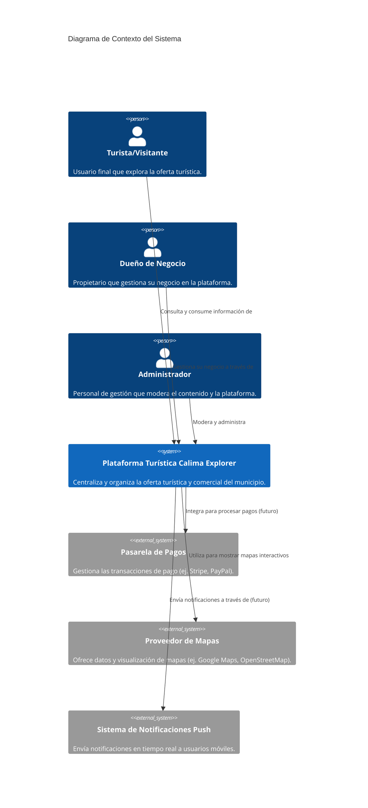
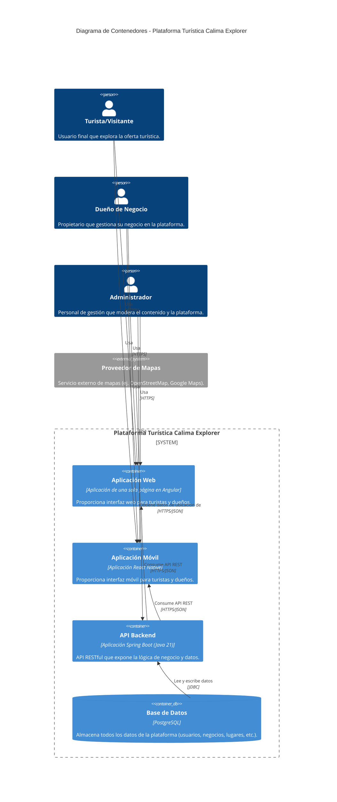

# Diagrama de Modelo C4

## Diagrama de Contexto del Sistema

```mermaid
C4Context
    title Diagrama de Contexto del Sistema

    Person(turista, "Turista/Visitante", "Usuario final que explora la oferta turística.")
    Person(dueno_negocio, "Dueño de Negocio", "Propietario que gestiona su negocio en la plataforma.")
    Person(administrador, "Administrador", "Personal de gestión que modera el contenido y la plataforma.")

    System(plataforma_turistica, "Plataforma Turística Calima Explorer", "Centraliza y organiza la oferta turística y comercial del municipio.")

    System_Ext(pasarela_pagos, "Pasarela de Pagos", "Gestiona las transacciones de pago (ej. Stripe, PayPal).")
    System_Ext(proveedor_mapas, "Proveedor de Mapas", "Ofrece datos y visualización de mapas (ej. Google Maps, OpenStreetMap).")
    System_Ext(notificaciones_push, "Sistema de Notificaciones Push", "Envía notificaciones en tiempo real a usuarios móviles.")

    Rel(turista, plataforma_turistica, "Consulta y consume información de")
    Rel(dueno_negocio, plataforma_turistica, "Gestiona su negocio a través de")
    Rel(administrador, plataforma_turistica, "Modera y administra")

    Rel(plataforma_turistica, pasarela_pagos, "Integra para procesar pagos (futuro)")
    Rel(plataforma_turistica, proveedor_mapas, "Utiliza para mostrar mapas interactivos")
    Rel(plataforma_turistica, notificaciones_push, "Envía notificaciones a través de (futuro)")
```

## Diagrama de Contenedores - Plataforma Turística Calima Explorer

```mermaid
C4Container
    title Diagrama de Contenedores - Plataforma Turística Calima Explorer

    Person(turista, "Turista/Visitante", "Usuario final que explora la oferta turística.")
    Person(dueno_negocio, "Dueño de Negocio", "Propietario que gestiona su negocio en la plataforma.")
    Person(administrador, "Administrador", "Personal de gestión que modera el contenido y la plataforma.")

    System_Boundary(calima_explorer, "Plataforma Turística Calima Explorer") {
        Container(app_web, "Aplicación Web", "Aplicación de una sola página en Angular", "Proporciona interfaz web para turistas y dueños.")
        Container(app_movil, "Aplicación Móvil", "Aplicación React Native", "Proporciona interfaz móvil para turistas y dueños.")
        Container(api_backend, "API Backend", "Aplicación Spring Boot (Java 21)", "API RESTful que expone la lógica de negocio y datos.")
        ContainerDb(base_datos, "Base de Datos", "PostgreSQL", "Almacena todos los datos de la plataforma (usuarios, negocios, lugares, etc.).")
    }

    System_Ext(proveedor_mapas, "Proveedor de Mapas", "Servicio externo de mapas (ej. OpenStreetMap, Google Maps).")

    Rel(turista, app_web, "Usa", "HTTPS")
    Rel(dueno_negocio, app_web, "Usa", "HTTPS")
    Rel(administrador, app_web, "Usa", "HTTPS")

    Rel(turista, app_movil, "Usa")
    Rel(dueno_negocio, app_movil, "Usa")
    Rel(administrador, app_movil, "Usa")

    Rel_Back(app_web, api_backend, "Consume API REST", "HTTPS/JSON")
    Rel_Back(app_movil, api_backend, "Consume API REST", "HTTPS/JSON")
    Rel_Back(api_backend, base_datos, "Lee y escribe datos", "JDBC")
    Rel_Back(api_backend, proveedor_mapas, "Obtiene datos de ubicación de", "HTTPS/JSON")
```