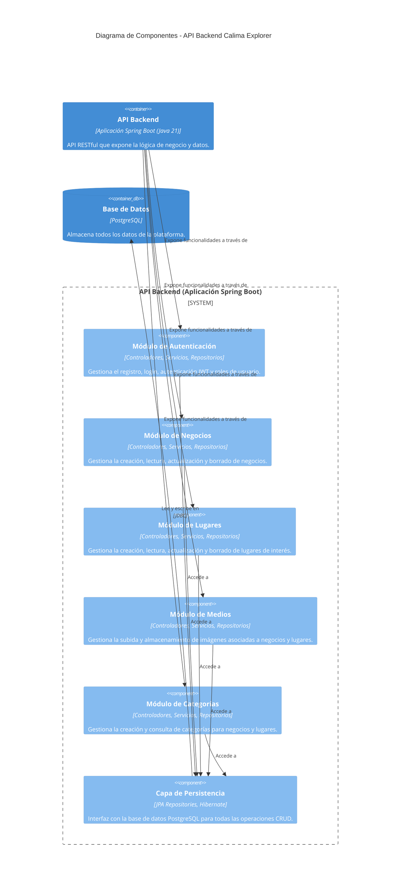

# Diagrama de Componentes - API Backend Calima Explorer

```mermaid
C4Component
    title Diagrama de Componentes - API Backend Calima Explorer

    Container(api_backend, "API Backend", "Aplicación Spring Boot (Java 21)", "API RESTful que expone la lógica de negocio y datos.")

    System_Boundary(api_backend, "API Backend (Aplicación Spring Boot)") {
        Component(auth_module, "Módulo de Autenticación", "Controladores, Servicios, Repositorios", "Gestiona el registro, login, autenticación JWT y roles de usuario.")
        Component(business_module, "Módulo de Negocios", "Controladores, Servicios, Repositorios", "Gestiona la creación, lectura, actualización y borrado de negocios.")
        Component(place_module, "Módulo de Lugares", "Controladores, Servicios, Repositorios", "Gestiona la creación, lectura, actualización y borrado de lugares de interés.")
        Component(media_module, "Módulo de Medios", "Controladores, Servicios, Repositorios", "Gestiona la subida y almacenamiento de imágenes asociadas a negocios y lugares.")
        Component(category_module, "Módulo de Categorías", "Controladores, Servicios, Repositorios", "Gestiona la creación y consulta de categorías para negocios y lugares.")
        Component(database_layer, "Capa de Persistencia", "JPA Repositories, Hibernate", "Interfaz con la base de datos PostgreSQL para todas las operaciones CRUD.")

        Rel(api_backend, auth_module, "Expone funcionalidades a través de")
        Rel(api_backend, business_module, "Expone funcionalidades a través de")
        Rel(api_backend, place_module, "Expone funcionalidades a través de")
        Rel(api_backend, media_module, "Expone funcionalidades a través de")
        Rel(api_backend, category_module, "Expone funcionalidades a través de")

        Rel(auth_module, database_layer, "Accede a")
        Rel(business_module, database_layer, "Accede a")
        Rel(place_module, database_layer, "Accede a")
        Rel(media_module, database_layer, "Accede a")
        Rel(category_module, database_layer, "Accede a")
    }

    ContainerDb(database_external, "Base de Datos", "PostgreSQL", "Almacena todos los datos de la plataforma.")

    Rel(database_layer, database_external, "Lee y escribe en", "JDBC")
```