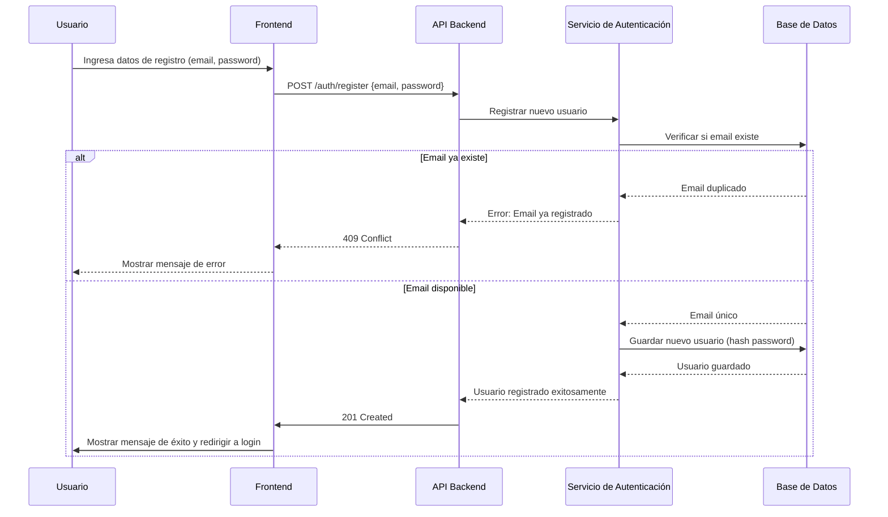
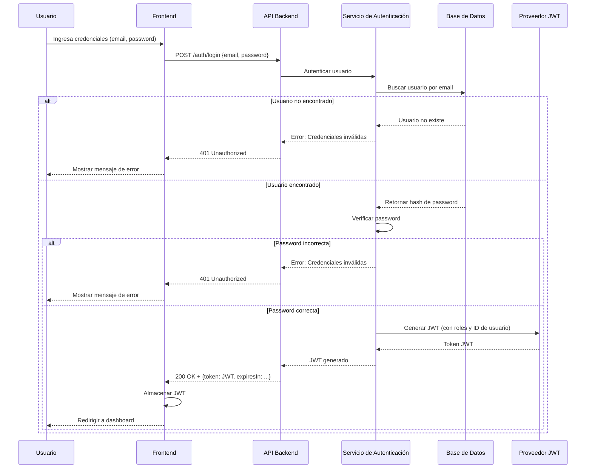

# Diagramas de Secuencia

## Diagrama de Secuencia: Registro de Usuario

```mermaid
sequenceDiagram
    participant Usuario
    participant Frontend
    participant APIBackend as API Backend
    participant AuthService as Servicio de Autenticación
    participant DB as Base de Datos

    Usuario->>Frontend: Ingresa datos de registro (email, password)
    Frontend->>APIBackend: POST /auth/register {email, password}
    APIBackend->>AuthService: Registrar nuevo usuario
    AuthService->>DB: Verificar si email existe
    alt Email ya existe
        DB-->>AuthService: Email duplicado
        AuthService-->>APIBackend: Error: Email ya registrado
        APIBackend-->>Frontend: 409 Conflict
        Frontend-->>Usuario: Mostrar mensaje de error
    else Email disponible
        DB-->>AuthService: Email único
        AuthService->>DB: Guardar nuevo usuario (hash password)
        DB-->>AuthService: Usuario guardado
        AuthService-->>APIBackend: Usuario registrado exitosamente
        APIBackend->>Frontend: 201 Created
        Frontend->>Usuario: Mostrar mensaje de éxito y redirigir a login
    end
```

## Diagrama de Secuencia: Login de Usuario

```mermaid
sequenceDiagram
    participant Usuario
    participant Frontend
    participant APIBackend as API Backend
    participant AuthService as Servicio de Autenticación
    participant DB as Base de Datos
    participant JWTProvider as Proveedor JWT

    Usuario->>Frontend: Ingresa credenciales (email, password)
    Frontend->>APIBackend: POST /auth/login {email, password}
    APIBackend->>AuthService: Autenticar usuario
    AuthService->>DB: Buscar usuario por email
    alt Usuario no encontrado
        DB-->>AuthService: Usuario no existe
        AuthService-->>APIBackend: Error: Credenciales inválidas
        APIBackend-->>Frontend: 401 Unauthorized
        Frontend-->>Usuario: Mostrar mensaje de error
    else Usuario encontrado
        DB-->>AuthService: Retornar hash de password
        AuthService->>AuthService: Verificar password
        alt Password incorrecta
            AuthService-->>APIBackend: Error: Credenciales inválidas
            APIBackend-->>Frontend: 401 Unauthorized
            Frontend-->>Usuario: Mostrar mensaje de error
        else Password correcta
            AuthService->>JWTProvider: Generar JWT (con roles y ID de usuario)
            JWTProvider-->>AuthService: Token JWT
            AuthService-->>APIBackend: JWT generado
            APIBackend-->>Frontend: 200 OK + {token: JWT, expiresIn: ...}
            Frontend->>Frontend: Almacenar JWT
            Frontend-->>Usuario: Redirigir a dashboard
        end
    end
```